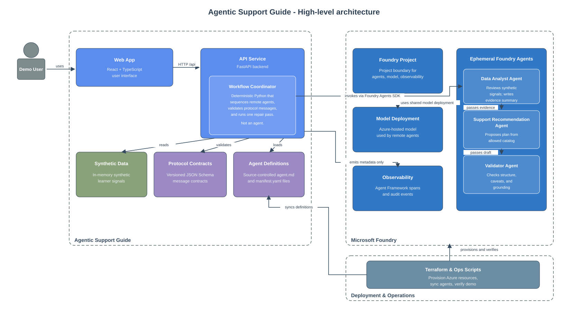

# agentic-support-guide

> **Start Here.** This is a local prototype. Every learner shown on screen is
> synthetic. When it is connected to Azure AI Foundry, three collaborating
> agents run real language-model calls to produce a structured, validated
> support recommendation.

> **Prototype scope.** This prototype uses synthetic data. It is intended to
> demonstrate architecture and workflow patterns, not to make production
> educational, legal, compliance, medical, disability, or placement decisions.

## Start here (for teams new to this stack)

If you are new to agentic applications, Azure AI Foundry, DevOps, MLOps,
or GenAIOps, read these first — in order — before touching code:

1. [Getting started for new teams](docs/getting-started-for-new-teams.md)
   — concept-first tour of what an agent, a coordinator, and Azure AI
   Foundry are, and how this repo fits together.
2. [Architecture](docs/architecture.md) — pattern first, then this repo's
   implementation.
3. [Architecture diagram](docs/architecture-diagram.md) — the C4
   container view.
4. [GenAIOps](docs/genaiops.md), [Security and privacy](docs/security-and-privacy.md),
   [Observability](docs/observability.md) — concept-first, then repo.
5. [Glossary](docs/glossary.md) — plain-language definitions of every
   term used above.

## Architecture diagram

<p align="center">
  
</p>

Editable source: [docs/architecture.dsl](docs/architecture.dsl). Regenerate the SVG with `.\scripts\render-architecture-diagram.ps1` after changing the DSL.

More details: [docs/architecture-diagram.md](docs/architecture-diagram.md).

---

## What this app is (in plain language)

Imagine an admin console for someone who supports learners in a generic
education-style setting. The console has a Dashboard, an Assessments page,
a Supports plan builder, and an AI Audit trail.

When you use the Supports plan builder, you pick a learner, pick a support
category, and describe a concern in a text box. The app then runs three
short model calls in sequence. Each call has a specific job. Together they
produce a structured recommendation that a human reviews and approves.

- **Data Analyst Agent** looks at the learner's synthetic signals and writes
  a short evidence summary. It does not propose interventions.
- **Support Recommendation Agent** reads that evidence and proposes a
  structured plan (support tier, frequency, grouping, SMART goal
  candidates, strategies, next steps). It can only choose from an allowed
  catalog.
- **Validator Agent** checks structure, required caveats, and grounding.
  It uses deterministic Python rules, plus an advisory model critique.

Between those three agents sits a **deterministic coordinator** — plain
Python inside the FastAPI service. It orders the calls, validates each
inter-agent message against a JSON Schema, enforces timeouts and budgets,
and runs at most one repair pass if the validator rejects the draft. The
coordinator is **not** a fourth agent; it does not talk to a language
model.

This pattern is a small example of a **Microsoft Agent Framework**–style
workflow: multiple specialized agents exchanging typed messages, with a
central coordinator, structured output, prompt-injection defenses, and
metadata-only auditing.

The three agents are hosted as remote assistants in **Azure AI Foundry
Agent Service**. Foundry is the Azure service that owns the model
deployment, provides keyless Entra ID authentication, and is the
organizational unit for hosted agents, evaluation, and safety workflows.

## What is synthetic vs. real

- Every learner, school, group, KPI, and trend value in the UI is
  **synthetic**, generated by deterministic factories seeded with a fixed
  constant. Nothing on screen represents a real person.
- The language-model calls happen on Azure AI Foundry once the setup
  steps below are complete. The three agents receive synthetic context.

## How to know the demo is ready

- `GET /api/health/details` returns `"active_provider":
  "azure_foundry_agents"`, `"foundry_project_configured": true`,
  `"foundry_agents_bound": true`, and `"customer_demo_ready": true`.
- The in-app **Demo Guide** page shows a green *Customer demo ready*
  banner.
- `POST /api/recommendations/support-plan` returns `status: "ok"` with
  a three-agent trace.

## What is implemented now vs. remaining gaps

Implemented now:

- Three role wrappers in Python, each invoking a **remote** Azure AI
  Foundry Agent Service assistant via
  [`FoundryRemoteAgentAdapter`](services/api/app/foundry_agents/adapter.py).
- Deterministic coordinator, typed shared contracts, JSON Schema
  protocol validation at every hop, one-shot repair loop.
- Keyless Azure AI Foundry auth via `DefaultAzureCredential`.
- Terraform for AI Services account, Foundry project, model deployment,
  RBAC, Log Analytics + Application Insights.
- Sync script [`scripts/sync_foundry_agents.py`](scripts/sync_foundry_agents.py)
  with `--dry-run`, `--apply`, `--check-connectivity`, and `--rebind`
  modes, driving `azure-ai-agents` CRUD from
  `/agents/*/agent.md` + `manifest.yaml`.
- Rule-based privacy scanner, prompt-injection sanitization,
  metadata-only audit trail.

Remaining gaps (not implemented in this repo):

- No CI workflow runs the eval cases, sync script dry-run, or lint/test
  suite on push.
- No exported `docs/architecture.svg` (see the Architecture diagram
  section above).
- No automatic promotion gate that requires eval and safety checks to
  pass before an agent version is applied to Foundry.

Broader roadmap notes live in
[docs/future-azure-architecture.md](docs/future-azure-architecture.md).

---

## Monorepo layout

- [`apps/web`](apps/web/README.md) — React + TS + Vite frontend.
- [`services/api`](services/api/README.md) — FastAPI backend with the three agents.
- [`infra`](infra/README.md) — Terraform for Azure AI Foundry.
- [`docs`](docs/architecture.md) — architecture, security, ADRs.

Local ports:

| Component        | URL                     | Notes |
|------------------|-------------------------|-------|
| FastAPI backend  | `http://127.0.0.1:8000` | OpenAPI at `/api/openapi.json`, docs at `/api/docs`. |
| Vite dev server  | `http://127.0.0.1:5173` | Proxies `/api/*` to the backend without stripping the prefix. |

---

## Prerequisites

Install these once on the machine that will run the demo.

### Local software

| Tool | Minimum version | Purpose | Install / verify |
| --- | --- | --- | --- |
| Git | any recent | Clone this repo. | `git --version` |
| Visual Studio Code | any recent | Editing `terraform.tfvars` and `.env` (this guide assumes VS Code). | `code --version` |
| Python | 3.12+ (3.13 tested) | Backend service. | `py --version` on Windows; `python3 --version` elsewhere |
| Node.js | 18+ (25 tested) | Vite frontend. | `node --version` and `npm --version` |
| Terraform | 1.9+ | Provisions Azure AI Foundry infrastructure. | `terraform version` |
| Azure CLI (`az`) | any recent | Sign in for keyless auth (`az login`). | `az version` |
| PowerShell | 5.1+ or PowerShell 7 | The commands below use PowerShell syntax. macOS/Linux users can adapt with `bash`. | `$PSVersionTable.PSVersion` |

No Docker. No local database. No global npm or pip packages required.

### Azure prerequisites

- An **Azure subscription** where you can create resource groups, Cognitive
  Services accounts, and Log Analytics/Application Insights resources.
- A user or admin who can create **role assignments** (`Owner` or
  `User Access Administrator` on the target subscription or resource
  group). The stack assigns two roles: `Cognitive Services OpenAI User`
  and `Azure AI User`. If you cannot create role assignments yourself, ask
  your subscription admin to run `terraform apply` on your behalf, or to
  grant those two roles to your Object ID after apply.
- **Model quota** in the region you choose. Quota is per-region and
  per-SKU. If your subscription is new, request quota for `gpt-4.1-mini`
  on `DataZoneStandard` in your chosen region before the demo.
- The **subscription ID** that will host the demo. `az account show
  --query id -o tsv` prints the current subscription.

### Time and cost

- End-to-end setup from a fresh clone takes roughly 15–25 minutes,
  most of which is `terraform apply` provisioning the Cognitive Services
  account and model deployment.
- Cost is **pay-as-you-go** based on the model deployment and telemetry.
  For an intermittently-used demo, expect single-digit USD per day. Run
  `terraform destroy` when finished.

---

## Customer demo setup (Azure AI Foundry)

The customer demo path uses **Azure AI Foundry with real LLM calls**. There
is no runtime mock mode. If Azure AI Foundry is not configured, the
recommendation endpoint fails with a clear setup error and the in-app
Setup Status shows *Customer demo NOT ready*.

### Azure permissions you need

- Permission to create resource groups and Azure AI Services resources in
  the target subscription.
- Permission to create role assignments (**Owner** or **User Access
  Administrator** on the subscription/resource group), or an admin who can
  create them for you.

### Region and deployment SKU

Terraform requires you to pick a region. The `location` variable has no
default. Model availability, SKU support, and TPM quota vary by region.
Common choices: `westus3`, `eastus2`, `swedencentral`.

The default `model_sku_name` is `DataZoneStandard`, which keeps inference
traffic inside a single Azure data zone (US or EU) rather than routing
globally. Override in `terraform.tfvars` if you need a different SKU
(`Standard`, `GlobalStandard`, `DataZoneBatch`).

### One-time setup

**Step 1 — sign in and pick the subscription.**

```powershell
az login
$env:ARM_SUBSCRIPTION_ID = "<your-subscription-id>"
```

**Step 2 — configure Terraform variables in VS Code.**

```powershell
cd infra
Copy-Item terraform.tfvars.example terraform.tfvars
```

Open `infra/terraform.tfvars` in VS Code. The file is commented
top-to-bottom. At minimum, set `location`. Save and close.

**Step 3 — deploy Azure AI Foundry infrastructure.**

```powershell
terraform init
terraform plan
terraform apply
```

Plain `terraform init` respects the committed `.terraform.lock.hcl` and
gives you the exact provider versions this repo was validated against.
Use `terraform init -upgrade` **only** when you deliberately want to pull
newer providers within the version constraints in `infra/providers.tf`;
see [`infra/README.md`](infra/README.md#commands) for the trade-offs.

**Step 4 — populate the backend `.env` from Terraform outputs.**

Run the helper script from the repo root:

```powershell
cd ..
.\scripts\populate-env.ps1
```

It reads `terraform output` (including the sensitive Application Insights
connection string), writes `services/api/.env`, and overwrites any
previous file. Nothing sensitive is printed to the console. Re-run it
after any future `terraform apply` that changes outputs.

If you'd rather do it by hand, copy `services/api/.env.example` to
`services/api/.env`, then run `terraform output` inside `infra/` and
paste the values into the corresponding keys in `.env`. Use
`terraform output -raw application_insights_connection_string` to
reveal the sensitive value.

**Step 5 — provision the remote Foundry agents.**

The three role instructions live in `/agents/<id>/agent.md`. The sync
script creates or updates one remote assistant per role in Azure AI
Foundry Agent Service and writes the assistant IDs to
`.foundry/agent-bindings.local.json` (gitignored).

```powershell
python scripts/sync_foundry_agents.py --dry-run
python scripts/sync_foundry_agents.py --apply
```

Re-run `--apply` any time `agent.md` or `manifest.yaml` changes. The
script computes an `instructions_hash` and only touches remote agents
whose configuration has drifted.

### Start the app for the demo

Backend (one terminal):

```powershell
cd services\api
py -3.13 -m venv .venv           # first time only
.\.venv\Scripts\Activate.ps1
pip install -r requirements-dev.txt
uvicorn app.main:app --host 127.0.0.1 --port 8000 --reload
```

Frontend (a second terminal):

```powershell
cd apps\web
npm install                       # first time only
npm run dev
```

Open http://127.0.0.1:5173 and click **Demo Guide** in the left navigation.

> RBAC propagation can take several minutes. If the first recommendation
> request returns 401 or 403, wait a moment and retry.

### Demo-is-ready checklist

Before starting the demo, confirm all of these:

- [ ] `terraform apply` completed successfully.
- [ ] `azurerm_cognitive_account`, `azurerm_cognitive_account_project`,
      and `azurerm_cognitive_deployment` all exist (visible in the Terraform
      plan output).
- [ ] `services/api/.env` contains `AZURE_AI_FOUNDRY_PROJECT_ENDPOINT`
      and the per-role `FOUNDRY_MODEL_DEPLOYMENT_*` values.
- [ ] `.foundry/agent-bindings.local.json` exists with an entry for each
      of the three roles (produced by `sync_foundry_agents.py --apply`).
- [ ] `GET /api/health/details` returns
      `"active_provider": "azure_foundry_agents"`,
      `"foundry_project_configured": true`,
      `"foundry_agents_bound": true`, and
      `"customer_demo_ready": true`.
- [ ] The in-app **Demo Guide** page shows a green *Customer demo ready*
      banner.
- [ ] Generating a recommendation in **Supports** returns
      `status: "ok"` with a three-agent trace.
- [ ] **AI Audit** shows a new runtime row whose provider column is
      `Azure AI Foundry Agent Service (remote agents)`.

### Quick readiness probe

```powershell
curl.exe -s http://127.0.0.1:8000/api/health/details | python -m json.tool
```

Look for `"customer_demo_ready": true`.

### Reset between practice runs

Application state lives in memory. The simplest reset is to stop
`uvicorn` (Ctrl+C) and restart it.

For repeated practice, set `DEMO_RESET_ENABLED=true` in
`services/api/.env` (development machines only) and call:

```powershell
curl.exe -s -X POST http://127.0.0.1:8000/api/demo/reset
```

Never set `DEMO_RESET_ENABLED=true` in production.

---

## What to show in the customer demo (5–7 minute talk track)

1. **Dashboard.** Show the four KPI cards and both charts. Say the values
   are synthetic and explain that this is the “operating picture” pane.
2. **Assessments.** Change one filter (e.g. school = `SCH-001`) and show
   the trend chart and table refresh. Point at the *Local rule-based
   output* panel and note that not every panel needs an LLM.
3. **Supports.** Pick a learner (any `Learner 0001`–`0120`), pick
   *Early Literacy Support*, type a short concern (e.g. *"Letter-sound
   fluency is behind expected pace."*), and click **Generate
   recommendation**.
4. **The three agents.** As the recommendation loads and the workflow
   panel updates, name each agent in plain language:
   - *Data Analyst Agent reviews evidence.*
   - *Support Recommendation Agent proposes options.*
   - *Validator Agent checks safety, structure, and grounding.*
5. **The recommendation.** Show detected need, support tier, frequency,
   grouping, review window, and the human-review caveat. Point out that
   the output is structured JSON validated against a Pydantic contract,
   not free-form text.
6. **AI Audit.** Open the AI Audit page and show the new runtime row.
   Highlight that only metadata is stored — no prompts, completions, raw
   concern text, or secrets — and that the provider/model column shows
   the live Azure AI Foundry deployment.
7. **Close.** Restate that all data is synthetic, and that the app is a
   prototype for architecture and workflow patterns.

Keep the language generic. Do not mention any real customer, product,
person, meeting, or source document.

---

## Developer test mode (not a customer demo path)

Automated tests inject a fake Foundry client
(`services/api/tests/fakes.py::FakeFoundryClient`) into the
`FoundryRemoteAgentAdapter` via dependency injection. This is only
available inside `pytest`; there is no environment variable to enable
it at runtime. When the runtime cannot find bindings or an endpoint,
`/api/health/details` reports `"active_provider": "unconfigured"` and
sets `"customer_demo_ready": false`.

To run tests:

```powershell
cd services\api
.\.venv\Scripts\Activate.ps1
pytest
```

---

## Quality checks

Backend (`services/api`):

```powershell
ruff format --check .
ruff check .
mypy .
pytest
```

Frontend (`apps/web`):

```powershell
npm run build
npm run test
```

Infrastructure (`infra`):

```powershell
terraform fmt -check -recursive
terraform init
terraform validate
```

---

## Troubleshooting

### Python virtual environment
- **`python` or `py` command not found.** Install Python 3.12 or newer.
- **Activation script blocked on Windows.** Run PowerShell as your user
  and execute `Set-ExecutionPolicy -Scope CurrentUser -ExecutionPolicy RemoteSigned`.
- **`pip install` fails behind a proxy.** Set `HTTPS_PROXY` and retry.

### `npm install`
- **`npm` not found.** Install Node.js 18 or newer (this project was
  tested with Node 25).
- **`npm` reports vulnerabilities.** They are transitive dev dependencies
  and do not block build/test.

### Backend not running
- The frontend shows *API unavailable - start the local backend*.
  Restart `uvicorn app.main:app --host 127.0.0.1 --port 8000 --reload`.

### Vite proxy / API unavailable
- Ensure `apps/web/vite.config.ts` still proxies `/api` to
  `http://127.0.0.1:8000` and does not strip the `/api` prefix.

### Missing Azure Foundry environment variables
- `POST /api/recommendations/support-plan` returns
  `status: "provider_missing"`. Either the project endpoint is not
  configured or the sync script has not been run. Populate
  `services/api/.env` from the Terraform outputs, then run
  `python scripts/sync_foundry_agents.py --apply`, then restart the
  backend.

### RBAC 401 / 403 after Terraform apply
- Wait a few minutes. The `Cognitive Services OpenAI User` role
  assignment can take time to propagate.
- Confirm you are signed in as the same principal referenced by
  `principal_id`, or set `principal_id` explicitly in
  `infra/terraform.tfvars`.

### Foundry project or model deployment not found
- Re-run `terraform apply`. Confirm that the per-role
  `FOUNDRY_MODEL_DEPLOYMENT_*` values in `services/api/.env` match the
  deployment name output by Terraform (`model_deployment_name`), and
  that `AZURE_AI_FOUNDRY_PROJECT_ENDPOINT` matches
  `foundry_project_endpoint`.

### Foundry agents not bound
- `/api/health/details` reports `"foundry_agents_bound": false`. Run
  `python scripts/sync_foundry_agents.py --apply` to create the remote
  assistants and write `.foundry/agent-bindings.local.json`.

### Model deployment quota or region issues
- `terraform apply` fails on the deployment. Options:
  - Pick a region that supports your chosen model + SKU (`westus3`,
    `eastus2`, and `swedencentral` are common). Update the `location`
    variable in `terraform.tfvars`.
  - Try a smaller SKU: `model_sku_name = "Standard"` with
    `model_capacity = 1`.
  - If `DataZoneStandard` is not available in your region, fall back to
    `GlobalStandard` and note the change in your demo notes.

### Terraform provider or resource errors
- Try `terraform init -upgrade` to re-resolve providers within the
  version constraints in `providers.tf`, then re-run `terraform validate`
  and `terraform plan`. If the new resolution introduces problems, revert
  by restoring the committed `.terraform.lock.hcl`.
- Confirm the `azurerm` provider version is `>= 4.40.0, < 5.0.0`.

### Throttling (HTTP 429)
- The provider retries with jittered backoff. If it persists, request
  more capacity/quota for the deployment.

### Content-filter block
- The UI shows a specific state and never displays the concern text back.
  Rephrase and try again.

### Invalid model JSON
- The coordinator returns `status: "invalid_model_json"`. This is a
  guardrail; the malformed output is never surfaced. Retry.

---

## Scripts

- `scripts/populate-env.ps1` — read `terraform output` and write
  `services/api/.env` (overwrites).
- `scripts/sync_foundry_agents.py` — create/update remote Foundry
  agents from `/agents/<id>/agent.md` + `manifest.yaml`. Supports
  `--dry-run`, `--apply`, `--check-connectivity`, and `--rebind`.
- `scripts/run-backend.ps1` — activate the venv and start uvicorn.
- `scripts/run-frontend.ps1` — start the Vite dev server.
- `scripts/verify-demo.ps1` — call `/api/health/details` and print
  the demo-readiness fields.

These are optional convenience wrappers around the commands in this
README.

---

## Docs

- [Getting started for new teams](docs/getting-started-for-new-teams.md)
- [Architecture](docs/architecture.md)
- [Architecture diagram](docs/architecture-diagram.md)
- [GenAIOps](docs/genaiops.md)
- [Security and privacy](docs/security-and-privacy.md)
- [Observability](docs/observability.md)
- [Glossary](docs/glossary.md)
- [Future Azure architecture](docs/future-azure-architecture.md)
- [ADR — agent hosting (original, superseded)](docs/adr/0001-agent-hosting.md)
- [ADR — agent hosting on remote Foundry (current)](docs/adr/0002-agent-hosting-remote-foundry.md)
- [ADR — Foundry Terraform choices](docs/adr/0001-foundry-project.md)
