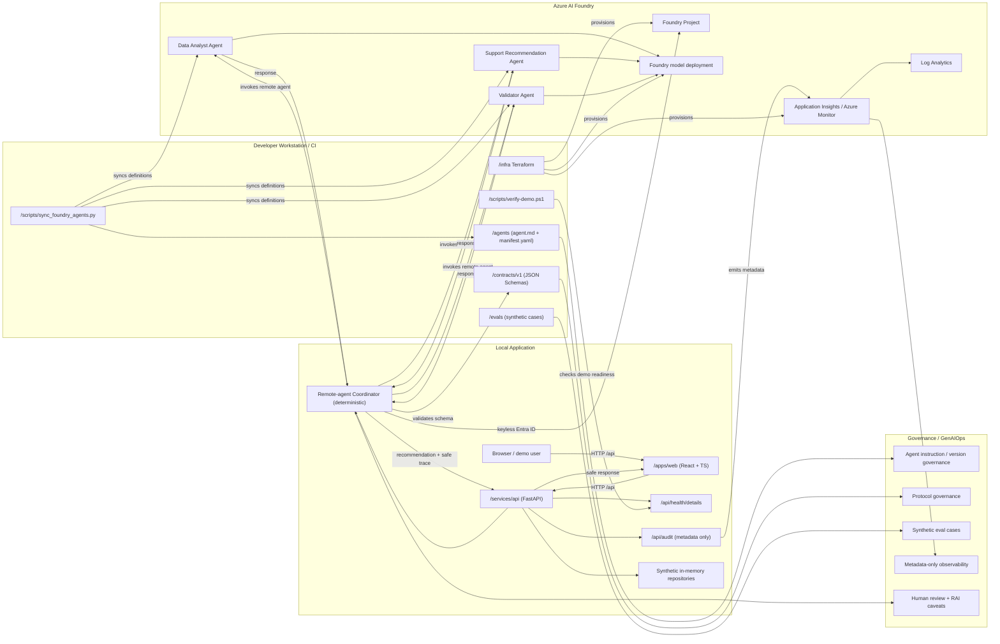

# High-level component architecture

Option 1 runtime: a deterministic FastAPI coordinator dispatches to three
remote Azure AI Foundry Agent Service agents. The coordinator is
service-side orchestration — it is not a fourth agent and never calls a
base model directly. All data in the demo is synthetic; no prompts or
completions are logged.

## Notes

- GitHub and VS Code both preview Mermaid natively; open this file to
  see the diagram.
- To edit in draw.io / diagrams.net, use Arrange -> Insert -> Advanced ->
  Mermaid and paste the block above.
- The coordinator is deterministic Python. All reasoning happens in the
  three remote Foundry agents.
- No prompts or completions are logged. Audit rows and Application
  Insights carry metadata only.
- Data used by the demo is entirely synthetic.
