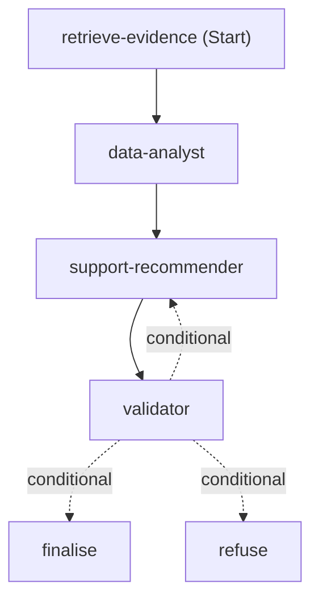

# Which orchestration pattern this repo uses

Agent Framework ships five multi-agent orchestration patterns. This repo uses
**one** of them, with one addition. This page says which, and what the other
four are for, so you can tell whether you need them.

Reference:
[Workflow orchestrations](https://learn.microsoft.com/agent-framework/workflows/orchestrations/).

## The answer

> **Sequential orchestration, plus one conditional edge that sends a failed
> draft back for a single repair attempt.**

Three agents run in a fixed order that never changes:

```
retrieve evidence -> data analyst -> support recommender -> validator
                                            ^                  |
                                            +-- one repair -----+
```

Retrieval and the analyst run **once**. Only the recommender's model call is
re-run, with the validator's guidance fed back in, and only once. The repair
then returns through the validator's deterministic checks; its advisory model
critique is not repeated. The analysis is not recomputed — it was not the
thing that failed.

This is the application's actual graph, rendered by `WorkflowViz` from the
same `build_plan_workflow` a request calls:

<!-- app-workflow:start -->

<!-- app-workflow:end -->

It is built in
[services/api/app/workflows/graph.py](../services/api/app/workflows/graph.py),
which is about thirty lines and is the whole orchestration.

Nothing chooses the order at runtime. No agent decides who goes next. The
only branch is the validator's verdict, and that branch is decided by a
deterministic Python rule set — eight checks in
[services/api/app/agents/validator/checks.py](../services/api/app/agents/validator/checks.py),
of which the citation and catalog checks are set-membership tests — not by a
model.

[workshop/code/07_conditional_repair.py](../workshop/code/07_conditional_repair.py) is
this shape as a runnable 150-line file you can execute offline.

## The five patterns, and why the other four are not here

| Pattern | What it does | Why not here |
| --- | --- | --- |
| **Sequential** | Agents run one after another in a defined order. | **This is what we use.** |
| Concurrent | Agents run in parallel on the same input; results are merged. | Each step needs the previous step's output, so there is nothing to parallelise. |
| Handoff | An agent decides to transfer control to another agent. | The route is fixed and must stay fixed — a dealer group's plan has to be produced the same way every time to be auditable. |
| Group chat | Agents converse in a shared thread until a condition is met. | Turn count is a tuning decision (`max_rounds`, termination conditions) for a task whose shape is already known. |
| Magentic | A manager agent plans and dynamically coordinates specialists. | The plan is known in advance. A manager would be a model deciding something a `for` loop already knows. |

Pick concurrent when steps are independent — that graph is just as drawable.
Pick handoff or magentic when you genuinely cannot write the route down in
advance. Pick sequential, as here, when the process is fixed and every plan
must be produced the same way to be auditable.

## "Handoff" means two different things

The word appears in this repo in a sense that is **not** the pattern above.

- `PlanRun.check_handoff` in
  [services/api/app/workflows/executors.py](../services/api/app/workflows/executors.py)
  and "handoff" in the agent manifests mean **passing data from one step to
  the next, validated against a JSON schema**. Every hop does it, always, in
  a fixed order.
- **Handoff orchestration** in Agent Framework means an agent *choosing* to
  transfer control to a different agent at runtime.

This repo does the first and not the second.

## Human in the loop: ours is post-hoc

Agent Framework has two in-workflow human-in-the-loop mechanisms. The
workflow pauses, asks, and resumes:

```python
# Tool approval: the workflow stops before a sensitive tool runs.
@tool(approval_mode="always_require")
def execute_database_query(query: str) -> str: ...

# Request info: pause after a named agent and wait for feedback.
workflow = (
    SequentialBuilder(participants=[drafter, editor, finalizer])
    .with_request_info(agents=["editor"])
    .build()
)
```

**This repo does neither.** Its workflow runs start to finish without
pausing. The human review happens *afterwards*, as a state machine over saved
plans in
[services/api/app/human_review.py](../services/api/app/human_review.py):
a generated plan is saved `pending_review`, and a person moves it to
`approved` or `rejected` through `POST /api/supports/plans/{id}/review`.

Both are legitimate. The difference is what the human is deciding:

| | In-workflow HITL | Post-hoc review (this repo) |
| --- | --- | --- |
| When | Mid-run, workflow suspended | After the run completed |
| Decides | Whether the run may continue | Whether the finished output may be used |
| Costs | Run state has to be held — in memory, or checkpointed so it can resume after a restart | Nothing; the run already finished |
| Right for | Irreversible actions — payments, deletes, deploys | Advisory output a person must approve before acting |

This system writes no customer data and takes no action, so there is nothing
to approve mid-run. Every plan still requires an explicit human review
transition before anyone acts on it, which is what the state machine records.

Be precise about what that records, though: the endpoint has no caller
identity, so `post_plan_review` writes `user_label="web-tier"` rather than a
person's name. It is an auditable *decision*, not an auditable *decider*.
Adding the second one means authenticating the reviewer.

If you add a tool here that *does* something — books an appointment, changes
a price — move that decision in-workflow with `approval_mode`. A review state
on a row cannot un-send an email.

## Where the app's orchestration actually lives

[services/api/app/workflows/graph.py](../services/api/app/workflows/graph.py).
It is a real `WorkflowBuilder` graph — six edges, three of them conditional —
and the diagram above is generated from that object, so the picture cannot
drift from the code.

Observability is Agent Framework's too:
[services/api/app/observability.py](../services/api/app/observability.py)
calls `configure_otel_providers` and `enable_instrumentation`, and the
framework then emits `workflow.run`, `executor.process` and `gen_ai` spans
for everything the graph does.

What is still this repo's own code is the part that is not orchestration: a
shared wall-clock budget, the per-step trace rows that go in the API response
and get rendered by the UI, a typed provider-failure taxonomy, and
JSON-Schema validation of every message between agents.

Learn the pattern from
[workshop/code/07_conditional_repair.py](../workshop/code/07_conditional_repair.py) — it
is short, runnable, and drawable. Then read `graph.py` and recognise the same
shape at full size.
