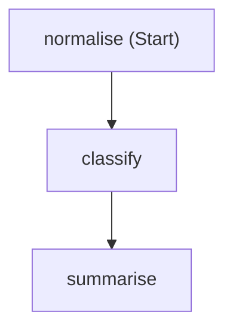
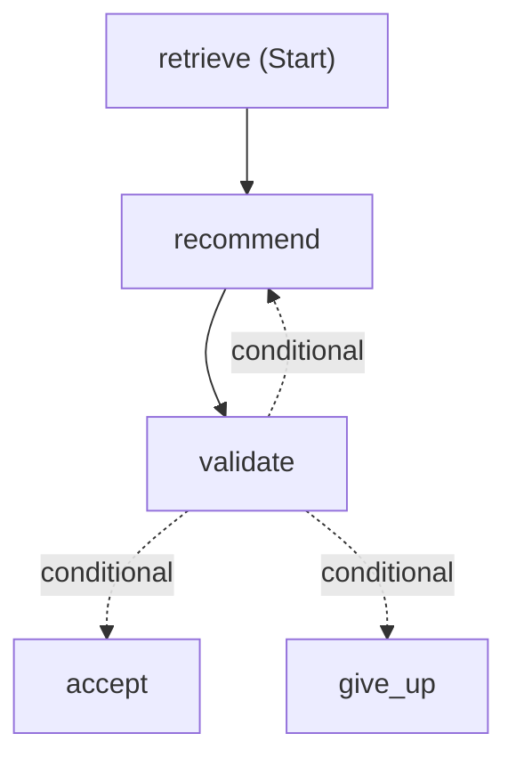

# Module 3 — Workflows

**Time:** 35 minutes.

**Goal:** a running three-agent workflow, and the ability to point at the
lines that make each of its guarantees hold.

Agent Framework gives you three words, and this module is only about them:

| Term | What it is |
| --- | --- |
| **Executor** | A step. It receives input, does work, emits output. |
| **Edge** | A connection that routes a value from one executor to the next. |
| **Workflow** | The graph they form, built with `WorkflowBuilder`. |

That is the whole model. Microsoft Learn covers each in depth —
[workflow concepts](https://learn.microsoft.com/agent-framework/concepts/workflows/),
[executors](https://learn.microsoft.com/agent-framework/concepts/workflows/executors),
and [edges](https://learn.microsoft.com/agent-framework/concepts/workflows/edges)
— and this module builds one, then shows you the same graph running the app.

## 1. The smallest workflow

Run [code/05_first_workflow.py](code/05_first_workflow.py). No model, no
Azure, no network — three plain Python steps joined by two edges:

<!-- sample-05:start -->

<!-- sample-05:end -->

Those three words are the whole model:

- an **executor** is a step — a class with an `@handler` or a function with
  `@executor`;
- an **edge** joins two, and the target runs when the source sends a message;
- a **workflow** is `WorkflowBuilder(start_executor=...).add_edge(...).build()`.

Run [code/06_agents_in_a_workflow.py](code/06_agents_in_a_workflow.py), which
swaps two plain steps for agents. That is **sequential orchestration**.

Now run [code/07_conditional_repair.py](code/07_conditional_repair.py), which
adds the one branch this application uses:

<!-- sample-07:start -->

<!-- sample-07:end -->

Both diagrams are generated, not drawn: `render_workflow_diagram.py` builds
the workflow and calls `WorkflowViz(...).to_mermaid()`, and a test fails if
what is committed drifts from what the code produces.

`WorkflowViz` also renders images. `--svg` writes
`apps/web/public/workflow-graph.svg`, which the app shows under **Workflow
graph** at the foot of the agent panel on the Supports page, so the picture a
learner sees in the running UI comes from the same `build_plan_workflow` the
request uses:

```powershell
.\services\api\.venv\Scripts\python.exe scripts\render_workflow_diagram.py --svg
```

That path shells out to Graphviz `dot`, so it needs Graphviz installed. The
SVG is committed for exactly that reason — App Service has no `dot`.

The pattern is **sequential orchestration with one conditional repair edge** —
not handoff, concurrent, group chat or magentic.
[docs/orchestration-patterns.md](../docs/orchestration-patterns.md) covers the
others. The order is fixed; the only branch is the validator's verdict, and
Python decides it, not a model.

## 2. The app is the same graph

Three agents run in order, each needing the previous one's output:

| Agent | Input | Output |
| --- | --- | --- |
| Data Analyst | scores and operations history for one dealership | findings |
| Support Recommender | findings + allowed catalogs + retrieved evidence | a draft plan |
| Validator | the draft + the analyst findings | pass/fail + repair guidance |

The analyst sits between `retrieve` and `recommend`, outside the repair loop:
a rejected draft is the recommender's problem, so re-running the analysis
would cost a model call and change nothing.

Open [services/api/app/workflows/graph.py](../services/api/app/workflows/graph.py).
The entire orchestration is one expression:

```python
workflow = (
    WorkflowBuilder(
        start_executor=retrieve,
        name="support-plan",
        description="Sequential orchestration with one conditional repair edge.",
        # Only these two call yield_output; the rest send_message. Naming
        # them keeps a future yield hidden rather than joining the result.
        output_from=[finalise, refuse],
    )
    .add_edge(retrieve, analyse)
    .add_edge(analyse, recommend)
    .add_edge(recommend, validate)
    .add_edge(validate, finalise, condition=passed)
    .add_edge(validate, recommend, condition=needs_repair)
    .add_edge(validate, refuse, condition=repair_exhausted)
    .build()
)
```

Six edges. The three conditional ones are the validator's verdict: pass,
repair once, or give up.

Two details are load-bearing.

**`output_from=[finalise, refuse]`.** Only the two terminal nodes call
`ctx.yield_output`; the other four hand state on with `ctx.send_message`,
which never becomes a workflow output. Naming them here states that contract
rather than relying on it: if a later node started yielding, its payload would
be hidden instead of quietly joining the result `_single_result` expects to be
exactly one.

**The workflow is built per request, never cached.** A `Workflow` instance
refuses a second concurrent run with `WorkflowException: Workflow is already
running`, and these nodes hold one request's state.

## 3. The message that travels the edges

An edge routes a value. Here that value is one frozen dataclass, in
[services/api/app/workflows/plan.py](../services/api/app/workflows/plan.py):

```python
@dataclass(frozen=True)
class PlanState:
    concern: str
    evidence: EvidenceBundle | None = None
    analysis: DataAnalystOutput | None = None
    draft: SupportRecommendationDraft | None = None
    report: ValidatorReport | None = None
    attempts: int = 0
```

Each executor fills in one more field and passes it on with `with_()`, which
is `dataclasses.replace`.

> [!IMPORTANT]
> `frozen=True` is not a style preference. A node's outgoing edges share
> **one** message object and each condition is evaluated against it. When an
> earlier version mutated the state in place, the already-scheduled `passed`
> condition re-read the mutated object, saw a clean report, and fired too —
> one run, two outputs. A frozen dataclass makes that impossible.
> [test_sample_workflows.py](../services/api/tests/test_sample_workflows.py)
> reproduces it.

The three edge conditions are plain functions in the same file:

```python
def passed(state: PlanState) -> bool:
    return state.report is not None and state.report.passed


def needs_repair(state: PlanState) -> bool:
    return (
        state.report is not None
        and not state.report.passed
        and state.attempts < MAX_RECOMMENDER_ATTEMPTS
    )
```

`repair_exhausted` is the same shape with `>=`. No model decides the route.

Two more properties fall out of the graph shape:

- **Evidence is retrieved by the first executor**, not offered to the analyst
  as a tool it may call. If retrieval returns nothing the run stops with
  `evidence_missing` and no model is invoked at all.
- **No executor checks whether the previous one worked.** A failed step
  raises `StepFailed` carrying a finished result, which propagates out of
  `workflow.run()` so the coordinator catches it in one place. That is why
  the graph reads as six edges and nothing else.

## 4. Inside one executor

Every executor does the same four things around its agent call. `Recommend`
in [services/api/app/workflows/executors.py](../services/api/app/workflows/executors.py)
is representative:

```python
result = await self._run.step.call(
    agent_name,
    lambda: self._agent.recommend_with_counts(
        plan.require_analysis(),
        context,
        repair_guidance=guidance,
        deadline=self._run.state.deadline,
    ),
)
draft = result.draft
self._run.check_handoff(
    schema="support-recommendation-result.schema.json",
    source="support-recommendation-agent",
    target="validator-agent",
    payload=envelopes.recommender_payload(draft),
    agent=agent_name,
)
self._run.state.citations_proposed = result.citations_proposed
self._run.state.citations_accepted = result.citations_accepted
```

Those last two lines are why the app can say *"the model proposed three
citation ids and two matched the retrieved bundle"*. The wrapper drops an id
the retriever never returned, so it never reaches the validator and can never
appear as an issue code. Counting it here is the only way to see it.

`step.call` is in [services/api/app/workflows/steps.py](../services/api/app/workflows/steps.py).
One call does four jobs that every agent invocation needs:

1. **Budget check** — refuse to start a step whose deadline has already
   passed, rather than starting one that cannot finish.
2. **Invoke** — the lambda is the actual agent call.
3. **Trace** — append an `AgentTraceStep` recording the agent, status, the
   model that actually served the call, latency and token estimate. That is
   what the **Agent workflow** panel renders.
4. **Typed failure** — turn a provider error or bad model JSON into a
   caller-safe status. The mapping is `PROVIDER_ERROR_TO_STATUS` in
   [failures.py](../services/api/app/workflows/failures.py): the caller
   learns which *class* of thing went wrong, never the provider's message.

You saw all three repair outcomes in sample 7. The **Agent workflow** panel
shows the same thing from a live run: one row per attempt, with the issue
codes that sent the recommender back.

> [!NOTE]
> Telemetry is deliberately absent from that list. Agent Framework
> instruments the graph itself — `workflow.run`, `executor.process`,
> `edge_group.process` and a `gen_ai` span per model call — so a
> hand-written event stream would be a lower-fidelity copy. See
> [observability.py](../services/api/app/observability.py); the whole
> integration is two function calls.

## 5. The contract between agents

Every hop is emitted as a versioned JSON envelope and validated against a
schema before the workflow continues. The envelope is the checked interface;
the Python object is what the next executor receives.

[envelopes.py](../services/api/app/workflows/envelopes.py) builds them, with
`trace_id` carrying the same correlation ID on every hop of one request:

```python
message: dict[str, Any] = {
    "schema_version": SCHEMA_VERSION,
    "message_id": str(uuid.uuid4()),
    "trace_id": correlation_id,
    "created_at": datetime.now(UTC).strftime("%Y-%m-%dT%H:%M:%SZ"),
    "source_agent": source_agent,
    "payload": payload,
}
```

The schemas live in [contracts/v1/](../contracts/v1/). Open
[support-recommendation-result.schema.json](../contracts/v1/support-recommendation-result.schema.json):
`dealer_group_id` is required inside the payload, so the boundary travels
with every message. `step.check_protocol` validates it and raises
`StepFailed` with `PROTOCOL_VALIDATION_FAILED` naming the schema.

> [!NOTE]
> **"Handoff" here means passing data.** `check_handoff` and the word
> "handoff" in the agent manifests mean *this* — a validated hop from one
> fixed step to the next. Agent Framework also has a **handoff
> orchestration**, where an agent chooses at runtime which agent to transfer
> control to. This repo does not use that. See
> [docs/orchestration-patterns.md](../docs/orchestration-patterns.md).

**Try it.** Add a required property to that schema file, restart the backend,
and submit a request. You get a named contract failure pointing at the
schema — not a `KeyError` three functions later. Revert the change afterwards.

## 6. The checks that decide pass or fail

Open [checks.py](../services/api/app/agents/validator/checks.py). Every rule
is a function with the same signature, registered in one tuple:

```python
DETERMINISTIC_CHECKS: tuple[Callable[[ValidatorInput, Findings], None], ...] = (
    check_contract_version,
    check_dealer_group,
    check_catalog_membership,
    check_citations,
    check_caveats,
    check_support_tier,
    check_required_sections,
    check_forbidden_determinations,
)
```

No check short-circuits the others, so a draft that breaks three rules is
told about all three and one repair round can address everything.

`check_citations` is the one to read closely:

```python
def check_citations(payload: ValidatorInput, findings: Findings) -> None:
    if not payload.draft.citations:
        findings.flag("MISSING_CITATIONS", "citations")
        return

    allowed = set(payload.context.allowed_citation_ids)
    for citation in payload.draft.citations:
        if citation.dealer_group_id != payload.context.dealer_group_id:
            findings.flag("CROSS_DEALER_GROUP_CITATION", "citations")
        if citation.citation_id not in allowed:
            findings.flag("UNKNOWN_CITATION_ID", "citations")
```

A GROUP-B citation on a GROUP-A request is a set membership test, not a
prompt instruction. `allowed_citation_ids` came from the retriever, which was
already scoped to the requesting group.

**Try it.** Make `check_citations` return immediately. Run a request.
Nothing errors, the plan still looks right, and the guarantee is gone. Now
run `pytest` *with the check still disabled* and read which tests fail —
those tests are the guarantee, written down. Restore the check and confirm
they pass again.

To add a rule: write a function, add it to the tuple, then add the matching
entry to `_REPAIR_TEMPLATES` in
[repair.py](../services/api/app/agents/validator/repair.py), which tells the
recommender how to fix it. That pairing is enforced — a test parses
`checks.py` and fails if any code you can emit has no template.

## 7. The repair bound, and the clock

There is no repair *function*. The bound is the edge condition you already
read in section 3: `needs_repair` requires
`state.attempts < MAX_RECOMMENDER_ATTEMPTS`, which is 2. When it is
exhausted, `repair_exhausted` routes to `Refuse` instead, returning
`VALIDATION_FAILED_AFTER_REPAIR`. The back edge from `validate` to
`recommend` is a real cycle in the graph, but a bounded one: at most one
repair, then a typed refusal.

Two details worth copying:

- The repair pass is traced under its own name,
  `support-recommendation-agent:repair`, so you can see it happened.
- The recheck sets `use_llm_critique = plan.attempts == 1`. The critique is
  advisory and cannot change a verdict, so paying for it twice buys nothing.

The clock is one deadline, set once when the run starts:

```python
deadline=time.monotonic() + ORCHESTRATION_TOTAL_BUDGET_SECONDS,
```

Every `step.call` checks it before starting, and every agent invocation
receives it, so each per-call timeout is clamped to whatever remains. Five
steps do not get five full timeouts. Both numbers are in
[config.py](../services/api/app/config.py).

## 8. Publish the other three roles

`publish_prompt_agents.py --roles-only` reads the three role `agent.md` files,
composes each one's instructions exactly as the running app does, and creates
a new *version* of an agent named `asg-<role>-<your-alias>`.

Dry run first — it prints what it would create and calls nothing:

```powershell
.\services\api\.venv\Scripts\python.exe scripts\publish_prompt_agents.py --suffix <your-alias> --roles-only
```

Add `--apply` to publish. The three role agents then appear in the portal.


> [!WARNING]
> **Use `--roles-only`, not a bare `--apply`.** The publisher builds each
> version from `agent.md` alone, and a bare `--apply` would also republish
> agents you later create or edit in the portal. Anything added in the portal
> — an attached knowledge base above all — is not in that file, so the new
> version comes back with `Knowledge` empty, and traffic follows the newest
> version.

The backend does not call the published agents. `_build_runtime` in
[services/api/app/main.py](../services/api/app/main.py) loads every role from
`agent.md` when the app starts, so a prompt edit needs a backend restart but
no publish step. The published agents are the visible, versioned artifact of
the same definition. Keep them in step by re-publishing after a prompt change
and comparing the `instructions_hash` that `validate_agent_definitions.py`
prints.

## 9. Run it

`run-backend.ps1` starts uvicorn against `services/api` with
`services/api/.env` loaded. `run-frontend.ps1` starts the Vite dev server,
which proxies `/api` to the backend. Both block, so use two terminals.

```powershell
# Terminal 1
.\scripts\run-backend.ps1
```

```powershell
# Terminal 2
.\scripts\run-frontend.ps1
```

Open <http://127.0.0.1:5173>, pick a dealership, and submit a concern.

The request lands on `post_recommendation` in
[services/api/app/routers/supports.py](../services/api/app/routers/supports.py).
It is short, and it shows the division of labour between the HTTP layer and
the coordinator:

```python
request = _coordinator_request(payload, dealership, repos)
started = time.monotonic()
result = await coordinator.run(request)
```

`_coordinator_request` resolves the **allowed catalogs** before the workflow
starts:

```python
allowed_goal_ids=tuple(
    g.id for g in options.goals if g.category_id == payload.category
),
allowed_strategy_ids=tuple(
    s.id for s in options.strategies if s.category_id == payload.category
),
```

The recommender may only cite IDs this function handed it. The model does not
choose the universe it draws from.

Now read the trace. The UI panel shows a condensed view — the three agents
with provider, model, latency and status. The full trace, including the
evidence-retrieval step and per-step token counts, is in the API response
body.

> [!NOTE]
> **Coming back after Module 6? Where did my knowledge base go?**
> Skip this on a first pass — the fixture retriever is the right default here.
> Which retriever the backend uses depends on `EVIDENCE_SOURCE`, and the
> backend you just started is the local one. Module 6's Terraform change set
> that variable on App Service, not on your laptop, and `populate-env.ps1`
> does not write it either — so a local run uses `FixtureEvidenceRetriever`
> unless you say otherwise. To run this module against your own knowledge
> base, add both lines to `services/api/.env` and restart:
>
> ```
> EVIDENCE_SOURCE=foundry_iq
> FOUNDRY_IQ_KNOWLEDGE_BASE=asg-kb-<your-alias>
> ```
>
> Check rather than assume:
>
> ```powershell
> $api = "http://127.0.0.1:8000"
> (Invoke-RestMethod "$api/api/health/details").evidence_source
> ```
>
> Either works here. Both implementations satisfy the protocol in
> [services/api/app/evidence/retrieval.py](../services/api/app/evidence/retrieval.py),
> so the coordinator and all three agents are identical either way. Fixtures
> stay the default because they are deterministic and run offline.

## 10. Read a failure

Each typed failure is a distinct,
attributable outcome a caller can branch on:

| status | error_code | what happened |
| --- | --- | --- |
| `evidence_missing` | `EVIDENCE_MISSING` | retrieval returned nothing for this group |
| `invalid_model_json` | `AGENT_INVALID_JSON` | a model returned unparseable or off-schema JSON |
| `invalid_model_json` | `PROTOCOL_VALIDATION_FAILED` | valid JSON, wrong contract |
| `validation_failed` | `VALIDATION_FAILED_AFTER_REPAIR` | the validator rejected both attempts |
| `provider_timeout` | `AGENT_PROVIDER_TIMEOUT` | the model run exceeded its budget |
| `provider_throttling` | `AGENT_PROVIDER_THROTTLING` | out of tokens-per-minute quota |
| `provider_content_filter` | `AGENT_PROVIDER_CONTENT_FILTER` | a guardrail blocked the call |
| `provider_error` | `AGENT_PROVIDER_AUTH_DENIED` | the identity lacks a role |
| `provider_missing` | `AGENT_PROVIDER_MISSING` | no Foundry project is configured |

The provider rows come from `PROVIDER_ERROR_TO_STATUS` in
[services/api/app/workflows/failures.py](../services/api/app/workflows/failures.py),
which is the single table mapping an SDK exception type to a caller-visible
status. Throttling and a content-filter block are different problems with
different fixes, so they get different codes.

**Produce one.** Stop the backend, blank `AZURE_AI_FOUNDRY_PROJECT_ENDPOINT`
in `services/api/.env`, restart, and submit a request. You get
`provider_missing`, no recommendation body, and no stack trace. Put the
endpoint back and restart before continuing.

Nothing about this requires three agents. What produces it is the wrapper:
`classify_provider_error` turning an SDK exception into a status, and
`StepFailed` carrying a finished result out. A single-agent service can have
the same property, and most do not — they return prose, and the caller has
nothing to branch on.

## Check yourself

- [ ] The three role agents appear in the portal with your suffix.
- [ ] You ran the flow and read a complete trace.
- [ ] You can point at the line that stops a cross-group citation.
- [ ] You produced at least one typed failure on purpose.
- [ ] You checked whether your trace shows a repair pass on every run.

Next: [Module 4 — Prompt agents](module-4-prompt-agents.md)
